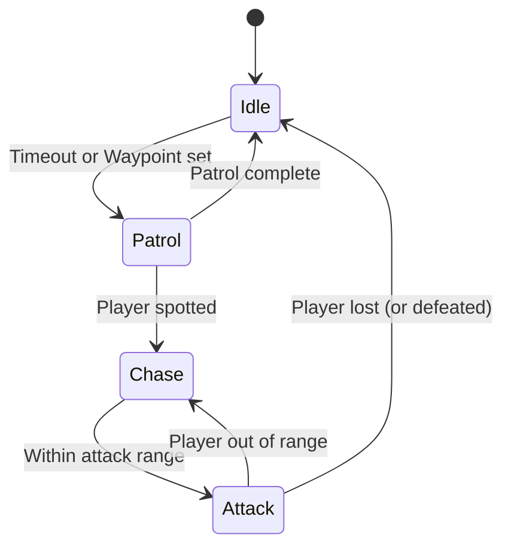

# Getting Started Guide for Godot 4 (3D Development)

Got it! I'll put together a structured **Getting Started Guide for Godot (Latest Version) with a Focus on 3D Development** tailored to a senior software engineer with basic Godot knowledge.

The guide will cover:
- **Godot’s Core Architecture** (Scene System, Nodes, Scripts)
- **GDScript vs. C# for Godot Development**
- **3D Rendering Basics (Lights, Materials, Shaders)**
- **Physics and Collisions** in 3D
- **Animations & Skeletal Systems**
- **Navigation & AI** in 3D environments
- **UI & Input Handling**
- **Optimization Best Practices** for performance
- **Building & Exporting a Game**

I'll also include **clear language analogies**, **code snippets**, and **diagrams using mermaid** where helpful. I'll let you know once it's ready!

## Introduction

Godot 4 is a powerful open-source game engine with a unique **scene-based architecture** that is ideal for 3D game development. This guide will walk you through core concepts and practical tips for building a 3D game in Godot, targeted at experienced software engineers who are new to advanced Godot 3D features. We assume you have basic familiarity with the Godot editor and GDScript. The guide is structured into key topics, with clear explanations, analogies, code snippets, and diagrams to help you quickly grasp and apply each concept.

## Godot’s Core Architecture: Scenes, Nodes, and Scripts

**Godot’s Scene System:** In Godot, everything is organized as a **scene tree**. A game is composed of *scenes*, and each scene is essentially a tree (hierarchy) of *nodes*. Each node has a specific role or function (e.g., a 3D model, a light, a sound, etc.). You can think of a scene as a **container or blueprint** of nodes that can be saved and reused (instanced) in other scenes ([Nodes and Scenes — Godot Engine (3.6) documentation in English](https://docs.godotengine.org/en/3.6/getting_started/step_by_step/nodes_and_scenes.html#:~:text=In%20Overview%20of%20Godot%27s%20key,also%20create%20your%20first%20scene)). This is similar to how a class in programming can be instantiated as multiple objects – in Godot, a scene can be instantiated multiple times as nodes in a larger scene. Scenes can also be nested (one scene instanced as a node in another), which encourages a modular design.

**Nodes – the Building Blocks:** Nodes are the fundamental building blocks of a Godot project ([Nodes and Scenes — Godot Engine (3.6) documentation in English](https://docs.godotengine.org/en/3.6/getting_started/step_by_step/nodes_and_scenes.html#:~:text=Nodes%20are%20the%20fundamental%20building,a%20camera%2C%20and%20much%20more)). Each node has a name and properties and serves a specific purpose. For example, there are nodes for 3D (spatial) objects, 2D objects, UI elements, physics bodies, cameras, etc. An analogy: **nodes are like Lego pieces** – each piece has a particular shape/function, and by combining them in a tree, you build complex structures. Some important node types in Godot 4 include:
- **Node3D** (formerly *Spatial* in Godot 3): Base for all 3D nodes (holds a transform in 3D space).
- **Node2D**: Base for all 2D nodes (holds a 2D transform).
- **Control**: Base for UI elements (buttons, labels, etc., in 2D GUI).
- **Node**: A generic node (no transform; useful for grouping or as a root).
- Many specialized nodes inherit from these (e.g., MeshInstance3D for 3D models, Camera3D, DirectionalLight3D, etc.).

 ([Nodes and Scenes — Godot Engine (3.6) documentation in English](https://docs.godotengine.org/en/3.6/getting_started/step_by_step/nodes_and_scenes.html)) *Illustration: Godot’s Node class hierarchy (partial). Node3D (formerly Spatial) is the base for 3D nodes, Node2D for 2D, and Control for UI. Godot organizes different game elements as nodes in a tree.*

**The Scene Tree in Action:** When you run a Godot game, it instantiates a scene as the root of the scene tree. All active nodes form a single tree managed by the engine. Nodes can have child nodes, and children inherit the transform (position/rotation/scale context) of their parent Node3D/Node2D. This hierarchy makes it easy to group things – e.g., a character Node3D may have a mesh, collision shape, and camera as children that move with the character. You can visualize it like this:

```mermaid
graph TB
  RootScene["Root Scene (Node)"]
  RootScene --> Player[Node3D "Player"]
  Player --> Camera[Camera3D]
  Player --> PlayerMesh[MeshInstance3D "Player Model"]
  Player --> PlayerCollision[CollisionShape3D "Player Collider"]
  RootScene --> Enemy[Node3D "Enemy"]
  Enemy --> EnemyMesh[MeshInstance3D "Enemy Model"]
  Enemy --> EnemyCollision[CollisionShape3D "Enemy Collider"]
```

*Diagram: Example scene hierarchy.* The **Root scene** contains a **Player** and an **Enemy** as child nodes. The Player has its mesh, camera, and collision shape as children. If the Player node moves, its children move with it (inherit the transform). This tree structure is central to how Godot works – organizing game entities and enabling parent-child relationships.

**Scripts and Node Behavior:** While nodes provide structure and built-in functionality, **scripts** bring them to life. In Godot, you attach scripts to nodes (typically one script per node) to define custom behavior. A script can be written in Godot’s native GDScript or other languages like C#. The script “extends” the node, similar to subclassing: e.g., a `Player.gd` script might extend `CharacterBody3D` (a type of Node3D for player physics) and implement game logic for the player. Because each node can have a script, you can think of a node+script together as analogous to an **object instance with methods**. Nodes communicate via method calls or **signals** (Godot’s built-in observer/event system), which decouple senders from receivers. For example, a button (Control node) can emit a `pressed` signal that your script listens to, or a body can emit a `collision` signal. Signals are Godot’s way of handling events without tight coupling; they are somewhat like C# events or callback hooks.

**Key Engine Callbacks:** Godot uses specific functions in your scripts to handle lifecycle and events:
- `_ready()`: Called when the node is added to the scene tree and ready.
- `_process(delta)`: Called every frame (good for per-frame logic).
- `_physics_process(delta)`: Called at a fixed timestep for physics-related logic (e.g., moving a character with consistent physics).
- `_input(event)` and `_unhandled_input(event)`: For input event handling (more on that later).

Understanding the architecture summary:
- Use **scenes** to group nodes logically (like prefabs or reusable components).
- Use **nodes** to represent entities and sub-entities in the game world.
- Use **scripts** to implement behavior, and connect **signals** for event-driven interactions.
This modular design keeps your game organized and is a core strength of Godot’s approach ([Nodes and Scenes — Godot Engine (3.6) documentation in English](https://docs.godotengine.org/en/3.6/getting_started/step_by_step/nodes_and_scenes.html#:~:text=,another%20node%20as%20a%20child)).

## GDScript vs C# for Godot Development

Godot 4 supports multiple scripting languages, with **GDScript** (Godot’s Python-like language) and **C#** (via Mono/.NET) being the most popular. Each has its pros and cons. As a senior developer, you might be comfortable with C# or C++ already, but GDScript is designed to integrate seamlessly with Godot.

**GDScript – Built for Godot:** GDScript is a high-level, dynamically-typed language with Python-like syntax, optimized for the engine. It’s concise and tightly integrated: you can write scripts directly in the editor with auto-completion for node names and properties. GDScript tends to make common gameplay code very succinct. It now supports optional static typing (type hints) to catch errors early, without the verbosity of C#. If you prefer quick iteration and a scripting feel, GDScript is a great choice. One analogy: if Godot were a car, GDScript is the steering wheel that’s custom-fitted – it feels natural to use in Godot’s environment.

**C# – Powerful and Tooling-Friendly:** C# in Godot lets you leverage the .NET ecosystem and a statically-typed OOP language. If you come from Unity or have extensive C# experience, you’ll find many similarities. Godot’s C# integration (in Godot 4) is much improved, offering access to most engine APIs. You can use external IDEs like JetBrains Rider or VS Code for rich intellisense and debugging. C# can offer better performance for heavy computations and more robust typing. However, using C# means you need the Godot .NET version and must manage an external build (the engine will compile your C# scripts).

**Which to choose?** It ultimately depends on your project needs and your preference:
- Use **GDScript** if you want maximum integration and rapid prototyping. It’s quick to write and usually “fast enough” for typical game logic ([State of GDScript vs C# performance in Godot 4.0 - Archive - Godot Forum](https://forum.godotengine.org/t/state-of-gdscript-vs-c-performance-in-godot-4-0/5875#:~:text=normally%20and%20fully%20support%20all,%E2%80%9D)). Godot’s design and docs primarily use GDScript, so learning resources are abundant. The dynamic typing is usually not an issue for gameplay, and the engine’s API was designed with GDScript in mind (making it feel very smooth).
- Use **C#** if you need stronger typing, are building something performance-intensive, or want to reuse .NET libraries. C# can outperform GDScript for math-heavy code (roughly up to 4× faster in some benchmarks ([State of GDScript vs C# performance in Godot 4.0 - Archive - Godot Forum](https://forum.godotengine.org/t/state-of-gdscript-vs-c-performance-in-godot-4-0/5875#:~:text=normally%20and%20fully%20support%20all,%E2%80%9D))), though both are ultimately scripting on top of the C++ engine. C# also provides better tooling (profiler, analyzers) and familiarity if you're coming from enterprise or Unity. Keep in mind C# has a **marshalling cost** when interacting with Godot API (crossing the boundary between managed C# and Godot's engine), but for large projects its structure can pay off.

**Mixing GDScript and C#:** You can actually use both in one project (e.g., some parts in GDScript and others in C#). They can interoperate through calls or signals, but there is a bit of overhead to consider. For simplicity, many projects pick one primary language. One current limitation: Godot 4’s web exports (HTML5/WebAssembly) do **not** support C# yet, so if web build is needed, you’ll stick to GDScript ([GDScript vs C# in Godot 4 | Chickensoft — Open source tools for Godot and C#](https://chickensoft.games/blog/gdscript-vs-csharp/#:~:text=like%20C%2B%2B.%20,incur%20a%20slight%20performance%20penalty)). 

**Syntax comparison:** To illustrate, here’s a simple example of moving a 3D node forward each frame in both languages:

*GDScript version (Player.gd):*  
```gdscript
extends CharacterBody3D
var speed = 5.0

func _physics_process(delta):
    if Input.is_action_pressed("move_forward"):
        # Move the body forward in its local -Z direction
        velocity.z = -speed
    else:
        velocity.z = 0
    velocity = move_and_slide(velocity, Vector3.UP)
``` 

*C# version (Player.cs):*  
```csharp
using Godot;
public partial class Player : CharacterBody3D
{
    [Export] public float Speed = 5.0f;
    public override void _PhysicsProcess(double delta)
    {
        if (Input.IsActionPressed("move_forward"))
            Velocity.z = -Speed;
        else
            Velocity.z = 0;
        Velocity = MoveAndSlide(Velocity, Vector3.Up);
    }
}
``` 

Both achieve the same result. GDScript is shorter and directly integrated (no compile step), while C# is more verbose but offers compile-time checks. As a seasoned developer, you might favor the stricter typing of C#, but don’t underestimate GDScript’s efficiency for gameplay scripting. Many developers use GDScript for most things and reserve C# (or even C++ via GDNative/GDExtension) for performance-critical systems. 

**Bottom line:** If you’re just starting with Godot’s 3D and want to get productive fast, GDScript is likely the path of least resistance. If you plan a large codebase or have specific .NET experience to leverage, C# is a solid alternative. Godot’s architecture (scenes/nodes) is the same either way, so choose the language that best fits your workflow.

## 3D Rendering Basics (Lights, Materials, Shaders)

Godot 4 brings a modern 3D renderer (Vulkan-based by default) capable of beautiful visuals. As you start building 3D scenes, you need to understand the basics of lighting, materials, and shaders in Godot.

**Lights in Godot 3D:** Lighting is crucial for 3D scenes. Godot offers several types of Light3D nodes:
- **DirectionalLight3D:** Think of this as the sun – light coming from an infinite distance in one direction. It lights the entire scene uniformly with parallel rays (good for outdoor sunlight or moonlight).
- **OmniLight3D (Point Light):** A light that emits in all directions from a point (like a bare light bulb). It has a range and attenuation (dimming over distance).
- **SpotLight3D:** Emits a cone of light in a specific direction (like a flashlight or street lamp). It has an angle (spot cutoff) and range.

Additionally, **ambient light** comes from the scene’s Environment (a resource set in a WorldEnvironment node) providing a base level of light (like global background illumination). Surfaces can also emit light via **emissive materials** (glowing surfaces), though that light doesn't automatically illuminate other objects unless you use global illumination techniques ([3D lights and shadows — Godot Engine (3.5) documentation in English](https://docs.godotengine.org/en/3.5/tutorials/3d/lights_and_shadows.html#:~:text=Light%20sources%20emit%20light%20that,of%20sources%20in%20a%20scene)). For realistic lighting, Godot 4 supports real-time **Global Illumination** (SDFGI) and baked lightmaps. SDFGI approximates bounced light in large scenes (like how light bounces off walls), and is great for dynamic lighting at some performance cost.

Each light type has parameters such as **color**, **energy (intensity)**, and whether it **casts shadows**. For example, an OmniLight can cast real-time shadows within its range (using a shadow atlas texture). Shadows and lighting can be tuned for quality vs performance (e.g., shadow resolution, number of cascades for directional light, etc.). A typical use case: you might use one DirectionalLight as the sun, a few OmniLights for lamps, and an Ambient light from the environment to simulate sky light. Keep lights count reasonable; each dynamic light that casts shadows can affect performance. Godot uses clustered rendering (in Forward+ mode) to handle many lights efficiently, but it’s still wise to disable shadows on lights that don’t need them or use culling masks to limit which objects they affect.

**Materials in Godot:** In 3D, objects are drawn using materials. Godot’s standard material system is based on **Physically Based Rendering (PBR)**. The most common material resource is **StandardMaterial3D** (formerly SpatialMaterial in Godot 3), which has many properties to achieve realistic surfaces:
- **Albedo (Base Color):** The base color texture or value of the surface.
- **Metallic and Roughness:** Control how shiny or matte the surface is (metallic surfaces reflect environment, roughness determines glossiness).
- **Emission:** Makes the material emit light (glow) of a certain color ([3D lights and shadows — Godot Engine (3.5) documentation in English](https://docs.godotengine.org/en/3.5/tutorials/3d/lights_and_shadows.html#:~:text=,affect%20nearby%20objects%20unless%20baked)).
- **Normal Maps, Ambient Occlusion, etc.:** Additional textures for details.

By tweaking these, you can create materials for metal, wood, glass, etc. Godot 4 uses energy-conserving PBR, so combining lights and materials gives realistic shading. You typically create a Material for a mesh by assigning it in the MeshInstance3D’s material slot (in the Inspector or via script). You can also use `ShaderMaterial` for custom shader code (see below).

**Applying Materials Example:** If you have a MeshInstance3D (say a cube), you can assign a material in code like:
```gdscript
var cube = $Cube  # MeshInstance3D node
var mat = StandardMaterial3D.new()
mat.albedo_color = Color(0.8, 0.2, 0.2)  # reddish color
mat.metallic = 0.5
mat.roughness = 0.1
cube.material_override = mat
```
This will make the cube a somewhat shiny red metal. In practice, you'll often use the editor to create materials, especially if using textures.

**Shaders:** For more advanced rendering effects, Godot lets you write custom shaders. A **ShaderMaterial** uses a user-written shader program (in Godot’s shading language, which is similar to GLSL). You might write a shader to achieve specific effects like holograms, water with waves, fancy animations on materials, etc. Godot’s shader language supports vertex, fragment, and light processors. For instance, a simple shader that makes an object pulse in color might look like:
```gdscript
shader_type spatial;

uniform float time;
uniform vec4 color : hint_color;

void fragment() {
    float intensity = sin(time * 2.0) * 0.5 + 0.5; // oscillates between 0 and 1
    ALBEDO = color.rgb * intensity;
}
```
(When used, you’d update the `time` uniform each frame via script or an AutoLoad to animate the effect).

However, you *don’t* need to write shaders for most cases – StandardMaterial3D is quite powerful. Shaders are there when default materials can’t achieve what you want. If you’re familiar with GLSL/HLSL, you’ll feel at home writing Godot shaders. Godot also provides a **Visual Shader** editor (node-based shader graph) if you prefer a visual approach.

**Rendering Notes:** Godot 4’s renderer has features like HDR, tone mapping, screen-space reflections (SSR), volumetric fog, and more. These are mostly configured in the **Environment** (WorldEnvironment node with an Environment resource). For example, you can add a sky texture, set ambient light, enable **SDFGI** for real-time GI, or use reflection probes for localized reflections. As a senior engineer, if you want to tweak rendering performance, know that Godot offers two rendering methods: Forward+ (default, handles many lights) and a compatibility mode (Mobile/Forward Clustered) which might be used for older hardware or the WebGL backend.

In summary, start with adding a **DirectionalLight3D** and a **WorldEnvironment** (for ambient light and sky), apply **StandardMaterial3D** to your meshes, and you’ll see your 3D objects lit nicely. Then explore adding Omni/Spot lights for interesting effects, and only dive into shaders when you need custom looks. The combination of lights and materials will give your scene its visual richness.

## Physics and Collisions in 3D

Realistic movement and interactions in a 3D game rely on the physics engine. Godot 4 uses a robust physics system (built-in Godot Physics or Jolt Physics under the hood) to handle rigid body dynamics, collisions, and forces. Understanding Godot's physics nodes is key to making things move and react naturally.

**Physics Bodies:** Godot provides four main types of physics bodies in 3D ([Physics introduction — Godot Engine (3.4) documentation in English](https://docs.godotengine.org/en/3.4/tutorials/physics/physics_introduction.html#:~:text=Godot%20offers%20four%20kinds%20of,physics%20bodies%2C%20extending%20CollisionObject2D)):
- **StaticBody3D:** A body that does not move (or is moved manually) but has a physical presence. Use this for immovable objects like floors, walls, or terrain. They collate with moving bodies but are not affected by forces.
- **RigidBody3D:** A body fully controlled by the physics engine. It has mass, can have forces applied, and will react to collisions (e.g., a crate that can be pushed or a ball that falls and bounces). You generally **do not directly reposition** a RigidBody each frame; instead you apply forces/impulses and let physics simulate it.
- **CharacterBody3D:** (New in Godot 4, replaces KinematicBody3D) – A body intended for user-controlled characters (players or NPCs). It doesn’t get automatic physics forces (so it won’t tip over or bounce by itself), but it can safely be moved by code (`move_and_slide()` or `move_and_collide()`) and will detect collisions. This is ideal for implementing a controllable character that interacts with the world but isn’t a ragdoll.
- **Area3D:** Not exactly a physical body, but an area that detects overlap of bodies. Areas can be used for trigger zones (e.g., an explosion radius, or a zone that when entered, does something) or for overriding physics properties (like a gravity zone).

In practice:
- Use **StaticBody3D** for environment geometry or objects that never need to move (they make the world solid).
- Use **RigidBody3D** for dynamic physics objects (debris, moving platforms that need inertia, projectiles if physics-driven, etc.).
- Use **CharacterBody3D** for things you control via script (like the player character, where you want explicit control over movement but still detect collisions).
- Use **Area3D** for detection volumes (e.g., an area that triggers a trap when the player enters).

Each physics body needs a **collision shape** to define its physical size. This is done by adding a **CollisionShape3D** (or CollisionPolygon3D) as a child of the body and assigning a Shape resource (like BoxShape, SphereShape, Capsule for character, ConvexPolygonShape, etc.). The shape acts as the “hitbox” for collisions. For complex static level geometry, you might use a **ConcavePolygonShape3D** (often generated from a Mesh) for static bodies. But concave shapes are not allowed on moving bodies (for those, use multiple simpler shapes or a convex decomposition).

**Collisions and Detection:** Godot’s physics engine will detect collisions between shapes on bodies. You can respond to collisions in a few ways:
- **Signals:** RigidBody3D emits signals like `body_entered` when another body contacts it (and similar `area_entered` for Area3D). CharacterBody3D doesn’t emit signals, but you can check collision info after a `move_and_slide()` call (methods like `get_slide_count()` and `get_slide_collision()`).
- **Direct checks:** Areas allow you to call `get_overlapping_bodies()` or use the PhysicsServer for advanced queries (like raycasting or shape casting).

A common pattern is to use **Area3D** nodes as triggers. For example, place an Area3D with a collision shape where you want a pickup item – connect its `body_entered(body: Node)` signal to a script to detect when the player enters, then grant the item and remove the area.

For RigidBody3D, since they are uncontrolled, you often just let them move and maybe use **contacts** to generate events. If you need something to happen on collision (say a projectile hitting an enemy), you could either make the projectile an Area3D (so it detects the collision immediately and then remove itself), or monitor collisions via a central script.

**Moving and Forces:** For **CharacterBody3D**, you manually move it in code. Typically in `_physics_process` you calculate an intended velocity from input and call `move_and_slide()`. This moves the body and handles sliding along surfaces (e.g., the player walking along the ground or up slopes) while detecting collisions. Character bodies are not affected by physics forces unless you code it (e.g., you apply gravity by adding a downward velocity each frame).

For **RigidBody3D**, you *apply forces*. You might use:
- `apply_impulse(offset, impulse_vector)` – to simulate an instant force (like a kick or explosion) ([How to get over your rigidbody3D in Godot 4 - YouTube](https://www.youtube.com/watch?v=VgbznUkiqx0#:~:text=How%20to%20get%20over%20your,10%2C%20Vector3.ZERO)).
- `add_force(force_vector, offset)` – to apply a continuous force (like wind).
- Directly setting `linear_velocity` or `angular_velocity` in some cases (though physics might override if not in the right mode).

Rigid bodies have modes (Rigid, Static, Character, Kinematic in Godot 3 terms; in Godot 4 they simplified to Rigid and CharacterBody separate classes). Usually, leave a RigidBody in Rigid mode. If you need to temporarily kinematically move it, you can set it to Static or use one of the APIs to temporarily disable physics.

**Example – Applying an impulse:** Suppose you have a RigidBody3D named "Ball" and you want to kick it when the player clicks:
```gdscript
func _on_PlayerKick():
    var ball = get_node("Ball") as RigidBody3D
    var impulse = Vector3(0, 5, -10)  # some impulse vector
    ball.apply_impulse(impulse, Vector3.ZERO)
```
This would knock the ball upward and forward. `apply_impulse(impulse, Vector3.ZERO)` applies the impulse at the body’s center (Vector3.ZERO in the body’s local coords) ([godot.RigidBody - Haxe/C# Godot API reference](https://haxegodot.github.io/godot/godot/RigidBody.html#:~:text=With%20Bullet%20physics%20,0%2C0%2C0%29%2C%20impulse%29)). If you apply off-center (non-zero offset), you’d also impart a rotation (torque).

**Physics Tick & Frame Independence:** Godot runs physics on a fixed timestep (default 60 FPS). Put your movement and physics code in `_physics_process(delta)` to tie into that system. This ensures consistent behavior regardless of graphical frame rate. For example, gravity might be applied as `velocity.y += -9.8 * delta` each physics frame. Keeping physics code in `_physics_process` also avoids missing collisions at high frame rates or having jitter.

**Collision Layers and Masks:** Godot allows filtering of collisions using layers and masks on physics bodies. Each body can be assigned to one or more **layers** (categories), and have a **collision mask** of what layers it interacts with. For example, you might put all enemies on layer 1, player on layer 2, environment on layer 3. Then set the player’s collision mask to collide with environment and enemies (layers 1 and 3), but enemies might only collide with environment and player, etc. This is very useful to prevent unnecessary collision checks or to have things like “ghost” objects that only collide with certain things.

**Physics and performance:** Godot’s physics is pretty fast, but for lots of moving objects, be mindful of cost:
- Use simpler collision shapes when possible (e.g., a rough box instead of a detailed mesh shape).
- Use Area3D sensors instead of full bodies if you don’t need physical response.
- Limit continuous collision detection (CCD) to fast objects that need it (prevents tunneling but costs more).
- You can run physics at a lower tick rate if needed for performance (in Project Settings).

In summary, Godot’s physics system will cover most needs out-of-the-box. Use CharacterBody3D for controlled characters, RigidBody3D for objects governed by physics, StaticBody3D for fixed colliders, and Areas for triggers. With these, you can handle everything from a player jumping on platforms, to throwing grenades that bounce, to detecting when a player enters a zone. Leverage the built-in signals for ease (connect `body_entered` from an Area to a function, etc.), and you’ll have a reactive, physics-rich 3D world.

## Animations & Skeletal Systems

Animation is how we bring our 3D models and scenes to life – from moving characters and enemies, to spinning collectibles, to complex cutscenes. Godot provides a flexible animation system that works for both skeletal animations (rigged characters) and generic property animations.

**AnimationPlayer:** The core of Godot’s animation system is the **AnimationPlayer** node. This node can store multiple animation tracks (as Animation resources) and play them back, blend them, etc. You can animate almost any property of any node, not just movement – visibility, color, transforms, even game variables. For example, you could animate a door opening by animating the rotation of a hinge node, or animate UI elements for a fancy menu.

Typically, for simple cases, you add an AnimationPlayer to your scene (e.g., as a child of a character or an object), then in the editor’s Animation panel, create a new Animation resource and start recording keyframes for properties over time. Under the hood, this creates animation tracks targeting specific node paths and properties.

**Skeletal Animation:** For animated 3D characters (with bones), Godot uses a **Skeleton3D** node and bone structure usually imported from your 3D modeling software (Blender, etc.). When you import a rigged model (via GLTF, FBX, etc.), Godot can import the skeleton and animations. These animations come in as AnimationPlayer tracks or separate .anim files that AnimationPlayer can play. The **Skeleton3D** node holds the bones, and a **Skin** on the MeshInstance3D ties the mesh vertices to those bones. Playing a skeletal animation adjusts the bones, which deforms the mesh (skinning).

For example, an imported character might have an AnimationPlayer with animations named “Idle”, “Run”, “Jump” corresponding to the skeletal animations from your DCC tool.

**Playing Animations:** To play an animation via code, you simply call:
```gdscript
$AnimationPlayer.play("Run")
```
You can check if an animation is playing with `is_playing()`, or connect the `animation_finished` signal if you need to know when it ends. You can also blend animations by using AnimationPlayer’s transition (call `play(blend)` with a blend time), or by manually adjusting animation tracks.

**AnimationTree (Advanced):** Godot offers an **AnimationTree** node which, in combination with an **AnimationStateMachine** or blend space, allows complex blending of animations (useful for characters that must blend multiple animations, e.g., running + shooting). For instance, you might blend an upper-body “shoot” animation with a lower-body “run” animation so the character can do both. Setting up an AnimationTree involves creating an AnimationTree node, assigning it an AnimationPlayer, and creating a state machine graph. States can blend via blend2 node or blendspace based on parameters (like a blend space 2D for walking direction). It’s a more advanced topic, but extremely useful for non-trivial animated characters.

**Skeletal Control and IK:** Godot 4 improved support for inverse kinematics (IK) and procedural animation via a SkeletonModificationStack on Skeleton3D. This allows things like foot placement on uneven terrain or ragdoll physics blending. For a getting started guide, it’s enough to know it exists; basic animation usually relies on preauthored animations.

**Using the Animation Editor:** In Godot’s editor, the Animation panel is where you add keyframes. Even without writing code, you can animate properties. For example, to animate a moving platform, you can keyframe its position at start and end, and Godot will interpolate. These keyframed animations can be played via AnimationPlayer.

**Animation via Code:** You can also create or modify animations in code if needed. The Animation resource has methods to add tracks and keyframes. But most of the time, using the editor or importing animations is simpler.

**Skeletal Setup Example:** Imagine you have a character scene:
```
Player (CharacterBody3D)
  ├── Skeleton3D (with bones: "Spine", "Arm.L", "Arm.R", etc.)
  ├── MeshInstance3D (the skinned mesh, uses the Skeleton)
  └── AnimationPlayer (with animations "Idle", "Walk", "Attack")
```
If you call `AnimationPlayer.play("Walk")`, the bones under Skeleton3D will animate accordingly (because the imported animation tracks target those bone transforms), and the MeshInstance will deform, showing the walking motion.

**Animating Non-Skeletal Objects:** For things like a rotating coin or a moving door, you could animate the rotation property. Either use AnimationPlayer or even simpler, use the scene tree and a script:
```gdscript
# Rotate a coin constantly
func _physics_process(delta):
    rotation.y += 1.0 * delta  # rotate 1 radian per second
```
But if you want a controlled sequence (like a door opening over 1 second when triggered), AnimationPlayer is handy: you create an "Open" animation that goes from closed to open rotation in 1 second, and then play it when needed.

**Blend Shapes:** If your model has blend shapes (morph targets, e.g., for facial expressions), Godot can animate those too via AnimationPlayer tracks (targeting the blend shape weight property on the MeshInstance).

**Example Code – Triggering an Animation:** Suppose your enemy has an AnimationPlayer with "Attack" animation. In code when the enemy AI decides to attack:
```gdscript
if not $AnimationPlayer.is_playing():
    $AnimationPlayer.play("Attack")
```
This will play the attack animation. If you connected a signal for animation end, you could then, say, apply damage to the player at that moment or switch state.

**Managing Animation States in Code:** Often you'll have logic to decide which animation to play (idle vs run, etc.). A simple approach is to check velocity or state:
```gdscript
if abs(linear_velocity.x) > 0.1 or abs(linear_velocity.z) > 0.1:
    if current_animation != "Run":
        $AnimationPlayer.play("Run")
        current_animation = "Run"
else:
    if current_animation != "Idle":
        $AnimationPlayer.play("Idle")
        current_animation = "Idle"
```
This ensures you only switch when needed.

Godot's animation system is quite powerful – you can animate almost anything, use scripts to blend or queue animations (e.g., `AnimationPlayer.queue("NextAnim")` to play after current finishes), and use AnimationTree for complex blending. As an experienced developer, you might find it reminiscent of other engines: conceptually similar to Unity’s Animator (AnimationTree) or Unreal’s animation blueprints, but leaner. A good practice is to separate your animations from your logic using state variables or AnimationTree, so your script just sets a state (like “moving=true, shooting=false”) and the AnimationTree handles which animation to play.

## Navigation & AI in 3D Environments

Creating intelligent NPCs or moving units in a 3D world often requires pathfinding and AI logic. Godot provides a **navigation system** for pathfinding, which you can leverage to move characters or agents around while avoiding obstacles. The AI part (making decisions, state machines, etc.) is something you'll script using general code, but the navigation system helps with the "how do I get from point A to B" problem.

**Navigation Meshes:** Godot uses **NavigationMesh** for 3D pathfinding. A NavigationMesh is essentially a collection of walkable polygons covering your game world surface. In Godot 4, the workflow is: Add a **NavigationRegion3D** node and provide it with a NavigationMesh (which can be baked from your level geometry in the editor). The NavigationRegion3D defines an area where pathfinding is possible (you can have multiple regions for different floors or disconnected areas).

After baking, the navmesh appears as a colored overlay on your level geometry, indicating where agents can walk. At runtime, you can ask the navigation system for a path. For instance, given a start and end position, it will return an array of points forming a path around walls and obstacles.

**Pathfinding Example:** If you have a NavigationRegion3D node named "NavRegion":
```gdscript
var nav = get_node("NavRegion") as NavigationRegion3D
var start_pos = enemy.global_transform.origin
var target_pos = player.global_transform.origin
var path: PackedVector3Array = nav.get_navigation_mesh().get_simple_path(start_pos, target_pos)
```
*(Note: In Godot 4, there are newer APIs via NavigationServer, but `get_simple_path` on a NavigationMesh or using a NavigationAgent is simpler.)* The result `path` is an array of points that the enemy can follow to reach the player, avoiding obstacles.

**NavigationAgent3D:** An even higher-level approach in Godot 4 is to use **NavigationAgent3D**. This is a helper node you can add (often as a child of an enemy or NPC) that automatically computes a path and helps follow it. You give it a target position (agent.target_position = ...), and it will calculate a path on the navmesh. You can then poll `agent.get_next_path_position()` every frame to move the character step by step, and it will also try to avoid collisions with other agents. NavigationAgent3D can also handle dynamic obstacles if you set up NavigationObstacle3D on moving bodies.

**AI (Artificial Intelligence):** With navigation handling movement, the "AI" part is the decision-making. Godot doesn’t have a built-in high-level AI framework – you script the behavior. Common approaches:
- **State Machines:** Define states for your AI (Idle, Patrol, Chase, Attack, etc.) and switch between them based on conditions. For example, an enemy might patrol until the player is seen, then switch to chase, and if in range, switch to attack. You can implement this with if/elif logic or a simple finite state machine structure in code.
- **Behavior Trees or Utility AI:** More complex AI might use behavior trees. Godot doesn’t have native behavior tree nodes, but you could code one or use an add-on. Given the scope, a finite state machine is usually sufficient for many games.

Let’s illustrate a simple AI state machine for an enemy with a Mermaid diagram:



In code, you might have an `enemy_state` variable and logic to handle each:
```gdscript
match state:
    "Idle":
        # perhaps look around or wait
        if can_see_player():
            state = "Chase"
        elif should_patrol:
            state = "Patrol"
    "Patrol":
        # move along a predefined path or random roaming
        if can_see_player():
            state = "Chase"
        elif patrol_done:
            state = "Idle"
    "Chase":
        # use navigation to move towards player
        agent.target_position = player.global_transform.origin
        move_along_path(agent.get_next_path_position())
        if distance_to(player) < attack_range:
            state = "Attack"
        elif !can_see_player():
            state = "Idle"  # lost sight
    "Attack":
        perform_attack()
        if distance_to(player) > attack_range:
            state = "Chase"
```
This is a simplistic representation, but shows how navigation (getting a path) integrates with the AI logic (deciding to chase or attack).

**can_see_player():** could be implemented via a raycast (cast a RayCast3D from enemy to player to check line of sight) or by distance + facing angle.

**Moving the enemy:** In the chase state, after obtaining the `path` or using the NavigationAgent, you actually move the enemy. If using CharacterBody3D for the enemy, you might compute a velocity toward the next path point and use `move_and_slide`. Or directly set the translation a bit closer each frame (if you bypass physics). For better movement, you’d also rotate the enemy to face movement direction using `look_at()`.

**Dynamic Obstacles:** If your game has moving obstacles (like moving cars or physics objects) that NPCs should avoid, Godot’s navigation can handle this via **NavigationObstacle3D**. An obstacle can be added to moving objects (like a RigidBody) and the NavigationAgents will dynamically avoid those when computing paths.

**Navigation Considerations:** 
- The navmesh is usually baked in editor, but you can also update it at runtime (re-bake or add regions) if the environment changes significantly (e.g., destructible walls – though Godot 4’s navmesh updates are not fully automatic, you might need to split your navmesh into regions and toggle them).
- Navigation meshes work on the principle of the agent’s **radius** and **height** (set in Navmesh settings) so that paths account for the size. Ensure those match your character size to avoid narrow path issues.
- For flying or 3D pathfinding (in the air), navmesh isn’t directly suitable (since it’s surface-based). You might implement your own or use waypoints.

**AI Beyond Movement:** The example above is a basic enemy AI. As a senior dev, you can certainly implement more complex logic. For instance, integrate a **decision-making** system where each enemy has certain behaviors (maybe a simple utility AI where they decide to flee if low on health, etc.). Godot doesn’t constrain you – you can structure your AI code in the way that makes sense (object-oriented with subclasses for different enemy types, data-driven, etc.). The key is to use engine features (timers, physics, navmesh, signals) to support the AI. For example, you might use an Area3D as a “vision field” (a cone-shaped area) that triggers when the player enters, as an alternative to raycasting for detection.

In short, **Navigation in Godot** gives you the pathfinding foundation, and **AI** is built on top with your scripts. Use NavigationMesh/NavigationAgent for movement, and implement state machines or other logic patterns for decision making. This combination will allow you to create NPCs that move realistically through the world and exhibit behaviors that make your game engaging.

## UI & Input Handling

Even in a 3D game, a user interface (UI) is often needed for menus, HUDs, or inventory screens. Godot’s UI system is based on **Control nodes** (which are part of the 2D scene). Handling player input (keyboard, mouse, gamepad, etc.) is another crucial aspect – Godot provides an Input event system and an InputMap to abstract actions.

### User Interface (UI) in Godot
Godot’s UI nodes (Control nodes) allow you to create on-screen elements that can anchor, scale, and respond to different screen sizes. These are things like **Button**, **Label**, **Panel**, **Sprite2D** (for images in UI), etc. UI nodes exist in a **2D canvas** that by default overlays the 3D world (although you can also have world-space UI in 3D if needed via Control in 3D, but that’s advanced).

Typically, you'll have a separate scene for UI or a branch in your main scene for UI. For example:
```
MainScene
  ├── ... (3D world nodes)
  └── CanvasLayer (for UI, ensures it’s drawn on top)
       ├── ScoreLabel (Label)
       ├── Crosshair (TextureRect)
       └── PauseMenu (Control, hidden by default)
```
A **CanvasLayer** is often used to decouple the UI from the 3D camera so it stays fixed on screen. The Control nodes under it will use screen coordinates.

Designing UI in Godot is done using the editor by adding Control nodes and setting their anchors/margins or using Container nodes for automatic layouts. For example, you might use a **VBoxContainer** to arrange menu buttons vertically, or an **HBoxContainer** for a row of elements.

**UI and Scenes:** You can create UI as its own scene (e.g., `PauseMenu.tscn`) and instance it in your main scene. This keeps things organized. Each Control node can be scripted too (e.g., a Button can have a script for what happens on press, or you can simply connect its `pressed` signal to a function in another script).

**Handling UI Input:** Control nodes automatically capture mouse and keyboard events if they are interactive. For example, clicking a Button will fire its signal and also consume that click so it doesn’t pass through to the game. Godot sends input events to the scene tree such that GUI elements get first dibs (they use an internal `_gui_input(event)` function). If a Control node handles the event (e.g., a Button click), it will `accept_event()`, meaning the event is marked as handled and won’t trigger your `_input` or `_unhandled_input` in other nodes ([Control — Godot Engine (stable) documentation in English](https://docs.godotengine.org/en/stable/classes/class_control.html#:~:text=Control%20%E2%80%94%20Godot%20Engine%20,specifically%2C%20it%20makes%20more)). This is usually what you want – clicking a UI button shouldn’t also make your character shoot because the click was consumed by the UI.

If you want a UI element to not block input, you can set its mouse filter to “Ignore”. But by default, assume UI controls will intercept relevant input events.

**Example – A Button Signal:** Suppose you have a Button for “Start Game” on a main menu. In the editor, you can connect the Button’s `pressed()` signal to a function in a script (e.g., attached to the Menu node). The generated function might look like:
```gdscript
func _on_StartButton_pressed():
    start_game()
```
This way, when the user clicks the button (or activates it with Enter/space or gamepad), `start_game()` is called (which could switch scenes, etc.). No need to manually poll input for UI; use signals.

**HUD Updating:** If you have a label showing score or health, you’ll update its text from your game script. For example:
```gdscript
# In Player.gd or GameManager.gd
func _process(delta):
    $CanvasLayer/ScoreLabel.text = "Score: %d" % score
```
This assumes you have a reference or node path to the UI label.

**UI Styling:** Godot supports themes and style customizations for UI nodes, but for getting started, you can use the default or minimal custom styling (like changing Button text, colors, etc. in the Inspector).

### Input Handling
For game input (moving characters, camera control, etc.), Godot uses an **action-based input system**. You define **Actions** (names like "move_forward", "shoot", "jump") in the **Input Map** (Project > Project Settings > Input Map tab), and assign keys, mouse buttons, or gamepad buttons/axes to those actions. This abstraction lets you check for actions in code instead of hardcoding key codes, and it automatically handles multiple input devices.

For example, you might have:
- "move_forward" → W key (and maybe Up arrow, and gamepad stick up)
- "move_back" → S key, etc.
- "jump" → Spacebar or A button on gamepad.

Once actions are set up, you use the **Input** API to query them:
- `Input.is_action_pressed("move_forward")` – returns true if the action is currently pressed (good for continuous movement).
- `Input.is_action_just_pressed("jump")` – true only on the frame the key was pressed down.
- `Input.is_action_just_released("fire")` – etc.

This is typically done in `_physics_process` or `_process`. For movement, `_physics_process` is preferred so it syncs with physics.

**Example – Character movement input (GDScript):**
```gdscript
var input_dir = Vector3.ZERO
if Input.is_action_pressed("move_forward"):
    input_dir.z -= 1
if Input.is_action_pressed("move_back"):
    input_dir.z += 1
if Input.is_action_pressed("move_left"):
    input_dir.x -= 1
if Input.is_action_pressed("move_right"):
    input_dir.x += 1

input_dir = input_dir.normalized()  # so diagonal isn't faster
velocity = input_dir * speed
velocity = move_and_slide(velocity, Vector3.UP)
```
This moves a CharacterBody3D based on WASD. We combine inputs into a direction vector, normalize it, scale by speed, and then use `move_and_slide`.

For actions like "jump", you might do:
```gdscript
if Input.is_action_just_pressed("jump") and is_on_floor():
    velocity.y = jump_speed
```
so that you only trigger a jump at the moment the key is pressed and only if on the ground.

**Mouse input:** Godot registers mouse buttons as actions too (e.g., "ui_click" or custom "shoot"). For mouse motion, you can use `Input.get_mouse_motion()` or capture the mouse for look-around (common in FPS games) using `Input.set_mouse_mode(Input.MOUSE_MODE_CAPTURED)` which hides the cursor and locks it, giving relative movement events. Then in `_input(event)`, check for `event.relative` for mouse movement deltas.

**InputEvent System:** Under the hood, every input (key, mouse, joystick) is an `InputEvent`. You can handle them either by polling as above or by overriding `_input(event)` in a node. If you override `_input`, you get called for every event before the engine routes it to the scene. You can check `if event.is_action_pressed("shoot")` inside `_input`, for example. However, for gameplay actions, polling with `Input.is_action_pressed` in `_process` is usually simpler. The `_input(event)` method is useful for more raw input handling or cases where order matters (like GUI or when you need to `accept_event()` to stop propagation).

Godot calls `_input(event)` on **all nodes** (from top to bottom in tree) for each event ([Input order confusion. - Archive - Godot Forum](https://forum.godotengine.org/t/input-order-confusion/25950#:~:text=Input%20order%20confusion.%20,unhandled_input%20%E2%86%90%20your%20tilemap)), and then `_unhandled_input(event)` on all nodes for events not yet handled. Typically:
- Use `_input` if you need to catch events early (like a top-level game script that pauses the game on Esc).
- Use `_unhandled_input` for gameplay input that should ignore events consumed by UI. For example, move the character on arrow keys in `_unhandled_input` so that if a UI dialog is open and catches the arrow key, the character won’t move.

Given our focus, the polling method in physics process (as shown in the example) is straightforward and commonly used for character controls.

**Gamepad and Others:** If you set up actions, gamepad buttons can be mapped to those actions and the same code works. You can also use `Input.get_vector("move_left", "move_right", "move_forward", "move_back")` which is a helper that returns a normalized 2D vector from two pair of actions (useful for WASD or arrow inputs, but in 3D you might still handle X/Z separately as shown).

**InputMap flexibility:** The Input Map means you can later change key bindings or have configurable controls without rewriting game logic – just map the actions differently. You can even add mappings in code (using `InputMap.add_action` and `InputMap.event_is_action`) if you want to support dynamic rebinding or detect input.

**Handling Multiple Input Types:** As a senior dev, you might consider the architecture: maybe a separate singleton (AutoLoad) for Input management that reads input and sets high-level state (like desired movement direction) that your game uses. Or simply handle input in the player script. Godot is flexible either way.

**C# Input:** In C#, the same concept applies: use `Input.IsActionPressed("action_name")`. The Input class is a static API available in C#. 

**Example – Shooting on click:**
If you have an action "shoot" tied to left mouse or a gamepad trigger:
```gdscript
if Input.is_action_just_pressed("shoot"):
    spawn_bullet_or_fire()
```
This will trigger exactly when the player clicks/shoots.

**Mouse Look (for 3D camera):** A common need in 3D games is to rotate the camera with the mouse (for FPS or third-person cameras). Typically:
- Hide/capture the cursor (`Input.set_mouse_mode(Captured)`) when game starts.
- In `_input(event)`, if `event` is InputEventMouseMotion and the mouse is captured, use `event.relative` to get movement delta. Then rotate the camera or character accordingly (e.g., adjust yaw, pitch angles).
For example:
```gdscript
func _input(event):
    if event is InputEventMouseMotion and Input.get_mouse_mode() == Input.MOUSE_MODE_CAPTURED:
        yaw -= event.relative.x * sensitivity
        pitch -= event.relative.y * sensitivity
        pitch = clamp(pitch, -1.5, 1.5)  # limit vertical angle
        $Camera3D.rotation = Vector3(pitch, yaw, 0)
```
This would rotate a Camera3D under the player based on mouse movement.

**Touch Input:** If developing for mobile, the Input Map can handle touch as left mouse by default, or you can handle multi-touch via the `InputEventScreenTouch` and `InputEventScreenDrag` events. 

**Input and UI together:** Suppose you have a pause menu on Esc. You might do:
```gdscript
if Input.is_action_just_pressed("ui_cancel"):  # default Esc in InputMap
    if not menu_visible:
        show_pause_menu()
    else:
        hide_pause_menu()
```
Here "ui_cancel" is a standard action Godot defines (Esc). We toggle a menu. When the menu is visible, you might set `get_tree().paused = true` to pause the game (except UI), and then unpause on resume. Godot’s pause mode can be set per node (so your UI can be set to `pause_mode = ProcessMode.ALWAYS` to still update when game is paused).

In essence, **Godot’s input system** is straightforward: define actions, poll or handle events, and let UI consume what it needs. With the examples above, you should be able to capture the necessary inputs for movement, actions, and UI interactions.

## Optimization Best Practices for 3D Performance

As your 3D project grows, performance optimization becomes important. Godot 4’s engine is efficient, but high-quality 3D can strain any system if not optimized. Here are some best practices and tips:

- **Polygon Count and LOD:** Keep your models at reasonable polygon counts. Extremely high-poly models will slow rendering, especially if many are on screen. For distant objects, consider using **Level of Detail (LOD)** techniques – Godot supports multiple meshes per MeshInstance3D for LOD or you can manually instance a simpler scene for far distances. For example, a tree could switch to a simpler mesh or even a billboard (a single quad with a tree image) when far away ([Optimizing 3D performance — Godot Engine (3.5) documentation in English](https://docs.godotengine.org/en/3.5/tutorials/performance/optimizing_3d_performance.html#:~:text=Level%20of%20detail%20)). The goal is to reduce detail when it’s not perceivable. Godot doesn’t auto-generate LOD, but you can create LOD assets yourself and switch by distance using a script or the LODGroup node (if available via add-on or custom logic).

- **Occlusion Culling:** Godot can perform frustum culling (objects outside camera view are not rendered), but you can improve performance by not rendering objects blocked by others. Godot 4 introduced a **Portal system (Room and Portal)** for indoor scenes where you define rooms and connecting portals (doorways) so the engine only renders rooms visible through portals. Use this for complex indoor environments to cull entire sections when not in view ([Optimizing 3D performance — Godot Engine (3.5) documentation in English](https://docs.godotengine.org/en/3.5/tutorials/performance/optimizing_3d_performance.html#:~:text=Portal%20Rendering%C2%B6)). Even without portal system, think about occlusion in design: large occluders (walls, hills) reduce what the camera sees. Godot currently doesn’t have automatic dynamic occlusion culling for arbitrary scenes, so you might implement some manual culling for large sections (e.g., hide entire chunk of a level if the player is far and it’s not in view).

- **Materials and Draw Calls:** Each mesh surface with a unique material is a separate draw call. Try to **reuse materials** on multiple objects so they can be batched. Godot automatically **batches** drawing for objects that share a material and are drawn consecutively. Also, avoid excessive use of **transparent materials**, as transparency defeats certain batching and sorting optimizations (transparent objects must be drawn back-to-front and individually) ([Optimizing 3D performance — Godot Engine (3.5) documentation in English](https://docs.godotengine.org/en/3.5/tutorials/performance/optimizing_3d_performance.html#:~:text=Godot%20sorts%20objects%20by%20Material,surface%20with%20its%20own%20material)). For example, if you have many trees with leaves using alpha cutouts, consider using alpha scissor (cutout) instead of semi-transparent alpha blend where possible, or grouping them.

- **Lighting and Shadows:** Each shadow-casting light adds rendering cost. Limit the number of lights affecting a given area. If you have many small lights, consider turning off shadows on most of them or using a simpler approach (like an emissive material instead of an actual light for small static glows). **Baked lighting** is an option for static scenes: use BakedLightmap (in Godot 4, it's via GIProbe/BakedLightmap node) to precompute lighting for static geometry, then you can use many lights with zero runtime cost (but static shadows). Real-time GI (SDFGI) is fantastic but can be heavy – if your game can work with baked GI or simpler ambient light, use those for better performance on low-end machines.

- **Physics Optimization:** If you have lots of physics bodies (hundreds of rigid bodies, etc.), consider simplifying collision shapes and turning off physics processing for things that don’t need it. Use **collision layers** to ignore collisions that are not needed (reduces the pair checks). If you have many objects that sleep (resting bodies), Godot will sleep them automatically; ensure that works (don’t apply tiny constant forces that prevent sleeping). You might also simulate some less critical physics at a lower rate manually (e.g., an AI check every 0.5 sec instead of every frame, though Godot’s built-in physics always runs at the fixed tick).

- **Visibility andInstancing:** Use **VisibilityNotifier3D** nodes to detect when objects are off-screen, and you can disable certain processing on them when not visible. For instance, an enemy AI script could stop updating when the enemy is far away and not visible to the player (to save CPU). Also, consider using **MultiMeshInstance3D** for large numbers of identical objects. MultiMesh can draw thousands of instances of a mesh in one draw call (like a field of grass or a swarm of identical particles). The trade-off is they won’t have individual Node logic, but for purely visual objects, it’s a big win.

- **Textures and Memory:** Use compressed textures (Godot supports VRAM compression like ETC, ASTC on mobile, etc. configured in import settings). Large uncompressed textures eat memory and bandwidth. Mipmaps should be enabled for textures (they are by default) to improve cache usage and avoid aliasing when textures are far away. If you have many big textures, consider resolution budgets for different platforms.

- **Scripts and GDNative optimization:** Write efficient code in hotspots. GDScript in Godot 4 is much faster than before, but heavy loops each frame can still hurt. If you must do heavy calculations (pathfinding for 100 agents, complex simulations), consider using threads or moving that logic to C++ via GDNative or Rust via GDExtension for a boost. But profile first – **use Godot’s profiler** to find bottlenecks. As the docs say, *the most important tool for optimization is the ability to measure performance* ([General optimization tips - Godot Docs](https://docs.godotengine.org/en/stable/tutorials/performance/general_optimization.html#:~:text=The%20most%20important%20tool%20for,success%20of%20our%20attempts)). Godot’s **Monitor** and **Profiler** (in Debug menu) can show you FPS, physics step time, and how much time each script function takes.

- **Use Appropriate Nodes:** Sometimes, using a specialized node can be more efficient than a generic one. For example, Godot has a **SkyShader/ProceduralSky** for sky background – use that instead of a giant inverted sphere mesh for sky. Use **ParticleSystem3D** (with GPU particles) for many particles instead of spawning hundreds of AnimatedSprite3D nodes (which would be heavier).

- **Optimize What’s Not Seen:** Avoid unnecessary processing for objects that the player can’t currently see or reach. This could mean turning off animations, physics, or even freeing entire sections of a level that are not needed (and re-instancing them later). If your game has large worlds, you might implement a basic **streaming** system: load scenes additively when player approaches a new area, and unload behind them.

- **GPU-Specific:** Godot 4 being Vulkan, ensure you’re not hitting GPU limits: too many materials, too high resolution post-processing effects can drop frame rate. For example, volumetric fog or DOF (depth of field) can be expensive; use sparingly or provide quality options. Shadows at 4K resolution are expensive – maybe 2048 or even 1024 is enough depending on the scene. Test on lower-end hardware if possible.

- **Profile on Target Devices:** If deploying to mobile, profile on mobile – what runs fine on PC might be slow on a mid-range phone. Use simpler materials or enable the Mobile renderer if needed for those platforms.

A quick checklist for optimization:
- Combine meshes if they are always together to reduce draw calls (but don’t combine too aggressively or you lose culling granularity).
- Remove unseen faces (for indoor, turn off backfaces or use occluder objects).
- Turn off collision on objects that don’t need it (an decorative mesh can have “Disable Collisions” in the import if you won’t interact).
- Keep an eye on the **Profiler**: look at frame time, physics time, and see if any script is spiking. Optimize that code (e.g., avoid allocating objects every frame in GDScript, use object pools for bullets, etc., because while GDScript has a garbage collector, less churn is always better).

By following these practices, you can often get a solid performance gain without sacrificing too much visual quality. Start simple: optimize the obvious big costs (large poly counts, too many lights, unneeded processing), then refine with profiling data.

## Building & Exporting Your Game

Once your game is ready (or even for testing on other devices), you’ll want to **build/export** it. Godot makes this process straightforward compared to many engines.

**Export Presets:** Godot uses export presets for each platform (Windows, Linux, macOS, Android, iOS, Web, etc.). In the Godot editor, go to **Project > Export...** to open the export dialog. The first time, you might need to **add an export preset** for your target platform.

 ([Exporting a Godot game to Windows](https://cyberglads.com/making-cyberglads-6-exporting-to-windows.html)) *Screenshot: Godot's Export dialog with a Windows Desktop preset. Here you can configure options and then export your project to a runnable build.* 

As shown above, on the left you have a list of presets (e.g., “Windows Desktop (Runnable)” in this case), and on the right, various options for that platform. Typical steps to export:
1. **Add a Preset:** Click “Add..” and select the target platform (e.g., Windows, Linux, HTML5, Android, etc.) ([Exporting a Godot game to Windows](https://cyberglads.com/making-cyberglads-6-exporting-to-windows.html#:~:text=Open%20Project%20,show%20the%20Export%20dialog)). Godot will add a new preset entry.
2. **Configure Options:** For each preset, you can set options:
   - **Name:** (optional) name of this preset.
   - **Executable:** For desktop, you might choose 32-bit vs 64-bit binaries. (Godot 4 defaults to 64-bit for desktop.)
   - **Texture Compression:** For mobile, choose what texture compression to include (ETC, ASTC, etc., Godot can include multiple to cover different GPUs).
   - **Icon, Identifiers:** For mobile/desktop you can set the application icon, version, company name, etc.
   - **Permissions (Android):** Set needed permissions for Android (Godot can auto-add some based on features).
   - **Export Path:** Not an option per se, but when you actually export, you’ll choose a path/filename for the build.
   - For Web, you can choose to export an **HTML5** build (which produces an HTML page with embedded wasm and PCK).

3. **Export Templates:** Ensure you have Godot’s export templates installed. As of Godot 4, if you download the official binaries, the export templates might be included or downloadable from within the editor. If not, download the matching templates from Godot’s website and install via Editor > Manage Export Templates. (This provides the platform-specific binaries that Godot will package with your game.) ([Exporting a Godot game to Windows](https://cyberglads.com/making-cyberglads-6-exporting-to-windows.html#:~:text=If%20you%27re%20exporting%20for%20the,from%20the%20Godot%20engine%20website))

4. **Export the Project:** Click “Export Project”, choose a location and filename. For desktop, you’ll typically get an `.exe` (Windows) or binary (Linux/macOS) **and a .pck** file (with game data) ([Exporting a Godot game to Windows](https://cyberglads.com/making-cyberglads-6-exporting-to-windows.html#:~:text=Click%20on%20%27Export%20Project%27%20Select,name%20Save%20the%20exe%20file)). Godot by default separates the executable and the data (PCK). You can distribute them together; the exe will look for the .pck with the same name. Alternatively, you can tick “Export PCK/Zip” to just get a PCK or zip. Or use an option to embed the PCK in executable (Godot 4 might allow embedding PCK in Windows exe via an option or using third-party tools, but by default it’s separate). On macOS, you’d get an .app bundle.

5. **Test the Exported Game:** Always run the exported game on the target platform. The editor runs with debug features (and can hide performance issues or have different behavior). Exporting by default makes a **release build** (no debug overlay, etc., and more optimized). If you need to test with debug features (like seeing print output or using the remote scene tree debugger), you can export a debug build by switching the preset’s “Release/Debug” option or selecting an export with Debug. But final shipping builds should be Release for performance.

6. **Distribute:** For Windows/Linux/mac, typically you zip up the executable and the PCK (and any other files like README). For Web, Godot produces a folder with an HTML, a .wasm, a .pck, etc. that you can upload to a server. For Android, you get an APK file ready to install or upload to Play Store (you’ll need to sign it – Godot can use debug keystore or you configure your own). For iOS, Godot exports an Xcode project that you then open in Xcode to sign and build on a Mac.

Godot’s export process is relatively simple because the engine is self-contained. Unlike Unity or Unreal, you’re not compiling source code (except C# scripts, which Godot handles in the build). The templates already contain the engine, so exporting basically packages your project assets + engine binary.

**Command Line Export:** You can also export via command line (using Godot’s headless mode) for automating builds, which might interest you if you set up CI/CD for your game. The syntax is something like:
```
godot --headless --export "Windows Desktop" path/to/your/project.exe
```
(as configured in export presets). This requires that you have an export preset set up in the project. This is useful for automated build pipelines.

**Version Control and Exported Files:** Typically, you do not version control the exported binaries, just the project source (scenes, scripts). The export can be reproduced anytime given the same Godot version and templates.

**Troubleshooting Exports:**
- If an export doesn’t run, run it from command line to see errors. A common issue is missing GDNative libraries or incorrect paths. Ensure any external files your game relies on are either in the project or handled properly.
- For C# projects, ensure the .NET runtime files are included. Godot will by default include the necessary assemblies in the export. You may need to ship `GodotSharp.dll` etc. that Godot generates, but usually the template takes care of it. The export dialog for .NET has a section to manage this (like embedding the mono runtime or using .NET 6). Follow [Godot docs on C# export](https://docs.godotengine.org/en/latest/tutorials/export/exporting_projects.html#exporting-mono-projects) if using C#.

**Testing on Devices:** If you’re exporting to Android or iOS, you’ll need to test on actual devices. Godot provides a **one-click deploy** for Android if you have the Android SDK/NDK configured (in Editor Settings). For iOS, you must export and then deploy via Xcode. Always test input, UI scaling, performance on the real devices.

**Iterative Development vs Export:** During development, you mostly test inside the editor (F5 to play). You don’t need to export every time. Only export when you want a standalone build or to test on another environment.

**Deployment:** Once you have a stable build, you can distribute it. For example:
- Upload the zip to itch.io or a similar indie platform. Godot exports are self-contained, users just unzip and run (on Windows, they double-click the .exe which will find the .pck).
- For Web, upload the HTML5 export (which is typically an HTML file plus a .pck and .wasm). Itch.io supports HTML5 games – you just zip the export and mark it as HTML. The Godot web build will initialize and run in browser (just ensure you enable WebGL 2 / WebGPU if needed – Godot 4 uses WebGL via WebGPU internally).
- For Play Store or App Store, you’ll follow their submission processes with the APK or IPA (from Xcode).

One more tip: when exporting, Godot can exclude certain files per preset. E.g., you might have high-res textures for PC and low-res for mobile, and configure filters so the mobile export uses the smaller ones. Check the “Filters” in export preset for excluding files by pattern.

Finally, remember to **turn off debug features** in release builds. Godot automatically strips most debug by using release templates. But if you added any debug draw or verbose printing, you should disable those. You can check Project Settings for things like “remove debug” or ensure your code doesn’t rely on `Engine.editor_hint` (which is false in exported game) incorrectly.

With export done, **you have your game ready to share or ship**. One of the advantages of Godot is how quick this process can be – often just a minute or two to get an updated build, which encourages frequent testing on target platforms.

---

**Conclusion:** You’ve now seen a broad overview of Godot 4’s 3D workflow and features – from how the engine is structured with scenes and nodes, to choosing a scripting language, to rendering setup, physics, animation, navigation, UI, optimization, and finally exporting your game. As an experienced developer, you’ll appreciate Godot’s simplicity and consistency. Its design encourages you to think in terms of scenes (which promote modularity) and to leverage the engine’s high-level nodes (which save you from reinventing wheels like GUI, physics, etc.). With the information and examples in this guide, you should be ready to embark on developing a 3D game in Godot, structured effectively and taking advantage of best practices from the start. Good luck, and happy coding with Godot!  ([Exporting projects — Godot Engine (latest) documentation in English](https://docs.godotengine.org/en/latest/tutorials/export/exporting_projects.html#:~:text=English%20docs,then%20compress%20the%20project))
